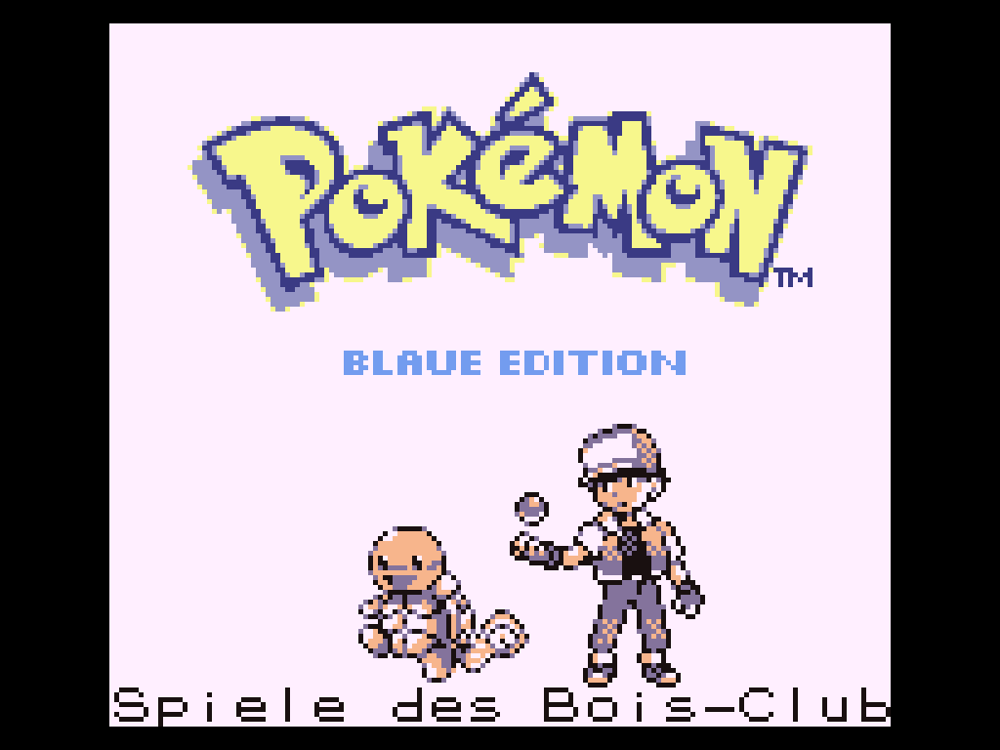
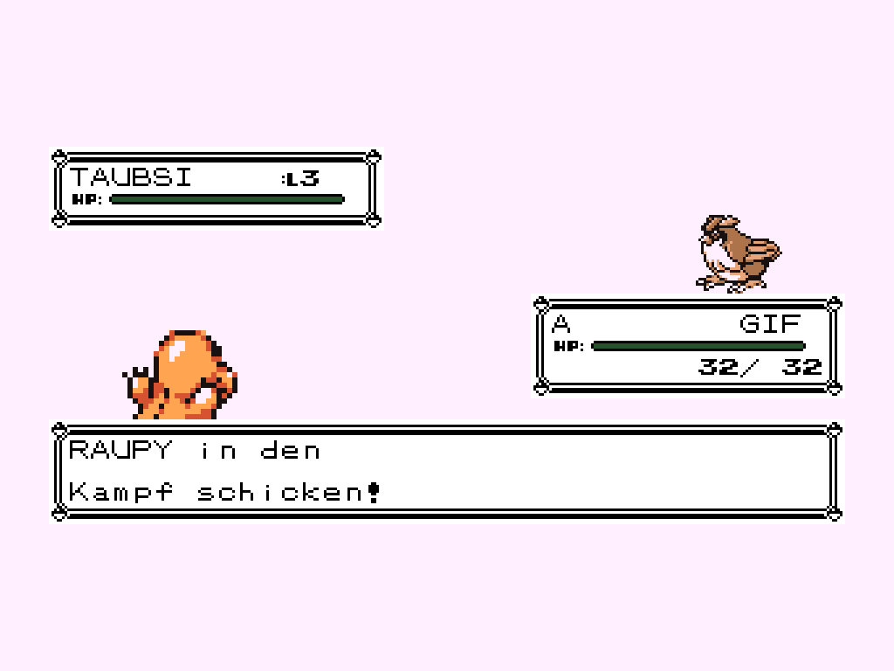
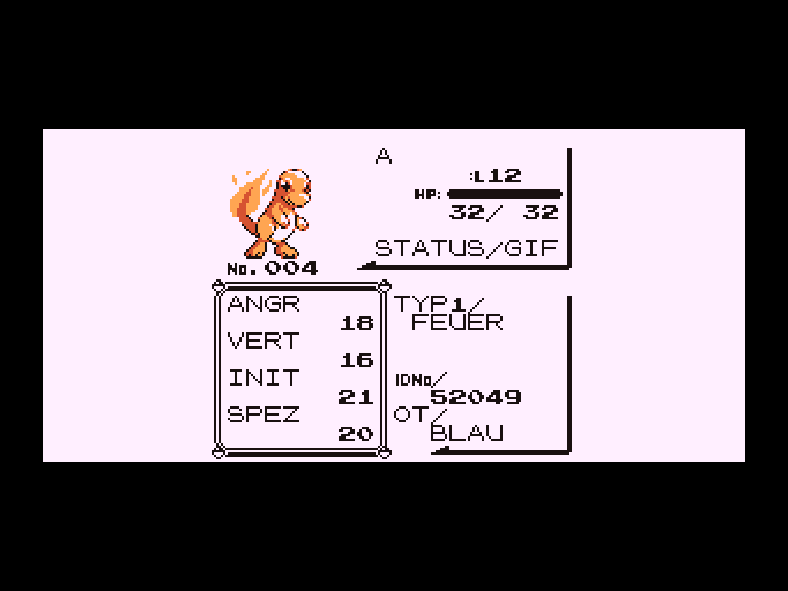

# Deutsch für Pokémon Blau

> **Eingestellt / archiviert:** Diese editionsspezifische Einzel-Mod erhält
> keine weiteren Updates. Die gepflegte Nachfolgeversion ist
> **Translation German Universal**, die Pokémon Rot, Blau, Gelb, Gold und
> Silber in einer einzigen Mod abdeckt.
>
> - [Universal-Repository](https://github.com/Roxas2712/translation-german-universal)
> - [Neueste Universal-Veröffentlichung](https://github.com/Roxas2712/translation-german-universal/releases/latest)

Diese Mod macht die kanonische US-ROM in Gen1Recomp auf Deutsch spielbar.
Aktuelle Version: **1.1.1**.

Die Inhalte wurden nicht maschinell übersetzt: Dialoge, Pokédex-Texte, Namen,
Schriftzeichen und die Titelgrafik stammen aus der unveränderten deutschen
ROM von **Pokémon Blaue Edition**. Nur zusätzliche Gen1Recomp-Oberflächen, die
im Game-Boy-Original nicht existieren, wurden separat übersetzt.

## Status

- 2.582 originale deutsche Dialog- und Pokédextexte
- originale deutsche Pokémon-, Attacken-, Item-, Trainer- und Typnamen
- originale Schrift mit Ä, Ö, Ü, ä, ö, ü und ß
- originale Titelgrafik „BLAUE EDITION“
- deutsche Menüs sowie übersetzte Gen1Recomp-Zusatzoberflächen
- deutsche Kampftexte einschließlich Trainerwechsel und Gegnerbezeichnung
- deutsche Status- und Wertekürzel wie GIF, ANGR, VERT, INIT und SPEZ
- deutsche Overworld-Schilder wie „ARENA“ statt „GYM“
- alle 151 Pokémon und 165 Attacken

## Bilder

## Installation

Bei einer bereits installierten Version im Launcher **Check for updates**
verwenden. Der manuelle Import überschreibt absichtlich keine Mod mit derselben
ID.

Für eine Erstinstallation unter **Releases** die Datei
`deutsch-blau-1.1.1.zip` herunterladen und in Gen1Recomp über
**MODS > Import mod .zip** auswählen. Für einen manuellen Umstieg muss die
ältere Ausgabe vorher entfernt werden.

Die Mod wird ausschließlich beim Start von Pokémon Blau aktiv; Rot und Gelb
bleiben unberührt. Für das Spiel wird weiterhin eine eigene, rechtmäßig
erworbene US-ROM von Pokémon Blau benötigt.

Die deutsche ROM wurde nur zur Erstellung ausgelesen; keine ROM wird
mitgeliefert oder verändert.

## Kompatibilität

Getestet mit Gen1Recomp Mod API 2. Die Mod verändert keine Spielstände und
übersetzt nur Darstellung und Inhalte.

## Hinweis

Inoffizielles Fanprojekt ohne Verbindung zu Nintendo, Game Freak oder
Creatures. Pokémon und zugehörige Namen, Grafiken und Texte sind Eigentum der
jeweiligen Rechteinhaber. Dieses Repository enthält keine ROM.
